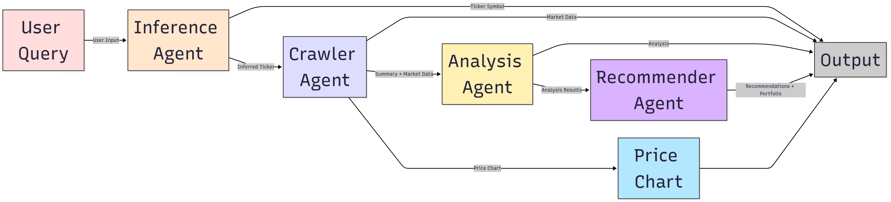

# 🏦 Multi-Agent Financial Intelligence Platform

This project implements a modern multi-agent financial intelligence platform using **LangGraph**, open-source LLMs, and market data tools. It handles natural language investment queries, extracts relevant ticker symbols, gathers market and qualitative data, performs deep analysis, and delivers structured, actionable recommendations.

The system integrates crawler scripts, multiple LLM-driven agents, and external APIs to deliver high-quality insights for investors, analysts, and automated trading tools.

---

## 📊 System Architecture

---

## 📊 Data Flow

The workflow proceeds in stages:

1. **User Query**  
   - Can be a **natural language query**, e.g., "invest in renewable energy" or "Apple company".  
   - Can also be a **ticker symbol**, e.g., `AAPL`, `TSLA`.  
   - The query is sent to the **Ticker Inference Agent** to extract the relevant ticker symbol.

2. **Ticker Inference Agent**  
   - If the user input is a valid ticker, it returns the ticker.  
   - If the input is a company name or a **misspelled ticker**, it infers the most relevant ticker symbol.  
   - If the input is an **old/outdated ticker symbol**, it finds the current updated symbol (e.g., `FB` → `META`).  
   - This guarantees that all downstream agents use the correct ticker symbol.

3. **Crawler Agent**  
   - Fetches data from multiple sources:
     - Yahoo Finance
     - Finnhub
     - Tavily
     - NewsAPI  
   - Produces raw summaries, financial metrics, and news content for the selected ticker.

4. **Analysis Agent (Groq LLaMA)**  
   - Performs quantitative and qualitative analysis on the crawled data.  
   - Produces stock outlook summaries.

5. **Recommender Agent**  
   - Generates actionable investment guidance:
     - Buy / Hold / Sell recommendations
     - Portfolio allocation suggestions
     - Risk management strategies

---

## 🌟 Key Features

- **Ticker Handling**: Automatically corrects old or misspelled tickers using LLM reasoning + search tools.  
- **Portfolio Awareness**: Extracts portfolio allocation suggestions and visualizes them.  
- **Streaming Output**: Each node’s results are displayed progressively in the frontend.  
- **Integration of Quantitative & Qualitative Data**: Combines financial metrics with market news and insights.  
- **Graph-Oriented Orchestration**: Uses **LangGraph** and **LangChain** to define and manage the workflow between agents efficiently.  
- **Robust Error Handling & Logging**: Detects missing or outdated data.  
- **User-Friendly Interface**: Simple Gradio interface with charts and formatted Markdown output.

---

## 📈 Technology Stack

- **Python 3.10+**
- **LangGraph**: Modern graph-based orchestration of agents
- **LangChain**: For prompt chaining and agent workflows
- **LLM APIs**: Gemini-2.0-Flash, Groq LLaMA 3.1 8B
- **Market Data**: Yahoo Finance, Finnhub, Tavily, NewsAPI
- **Visualization**: Matplotlib, Recharts, Markdown formatting in frontend

---

## 🔮 Future Enhancements

- Backtesting of recommended portfolios  
- Expanded data sources (Bloomberg, TradingView)  
- Options / derivatives support  
- Interactive dashboards with portfolio simulation and risk modeling
